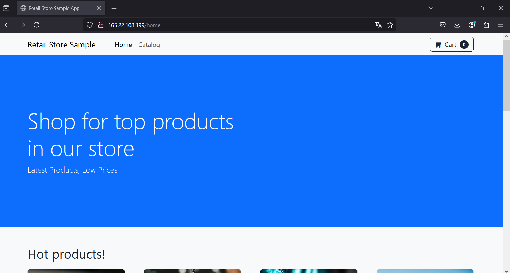
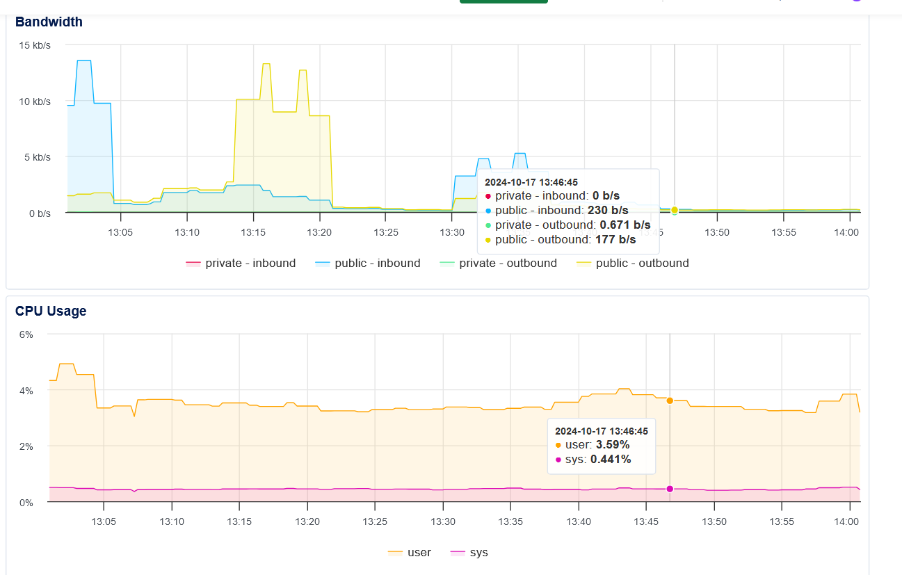

# Retail Store Sample Application

## Overview
This is a sample retail store application demonstrating a microservices architecture using various technologies. The application consists of multiple services that work together to provide a complete e-commerce experience.

## Architecture

The application consists of the following microservices:

- **UI Service** - Frontend interface (Java/Spring Boot)
- **Catalog Service** - Product catalog management (Go)
- **Cart Service** - Shopping cart functionality (Java/Spring Boot)
- **Orders Service** - Order processing (Java/Spring Boot)
- **Checkout Service** - Payment processing (Node.js)
- **Assets Service** - Static asset management

## Prerequisites

- Docker and Docker Compose
- Terraform >= 1.0.0
- GitLab account
- Git

## Infrastructure Setup

### Directory Structure
```
.
README.md
docker-compose.yml
.gitlab-ci.yml
terraform/
 main.tf
 provider.tf
 terraform.tfvars
```

### Configuration Files

1. Clone the repository:
```bash
git clone https://github.com/aws-containers/retail-store-sample-app.git
cd retail-store-sample-app
```

2. Set up Terraform configuration files in the `terraform` directory.

3. Update the `terraform.tfvars` file with your specific values.

4. Initialize and apply Terraform:
```bash
cd terraform
terraform init
terraform plan
terraform apply
```

## CI/CD Pipeline

The CI/CD pipeline is implemented using GitLab CI. The configuration is stored in the `.gitlab-ci.yml` file at the root of the repository.

## Infrastructure Management

### Creating New Resources
To add new infrastructure components:
1. Modify the Terraform files in the `terraform` directory
2. Apply changes:
```bash
cd terraform
terraform plan
terraform apply
```

### Destroying Infrastructure
To tear down the infrastructure:
```bash
cd terraform
terraform destroy
```

## Security Considerations

- Ensure all sensitive information is stored securely (e.g., in GitLab CI/CD variables)
- Regularly update dependencies and Docker images
- Implement proper access controls for your infrastructure

## Access the APPS
- Access the apps (http://165.22.108.199/home)


## Monitoring and Logging

- Implement monitoring and logging solutions as needed for your deployment environment
